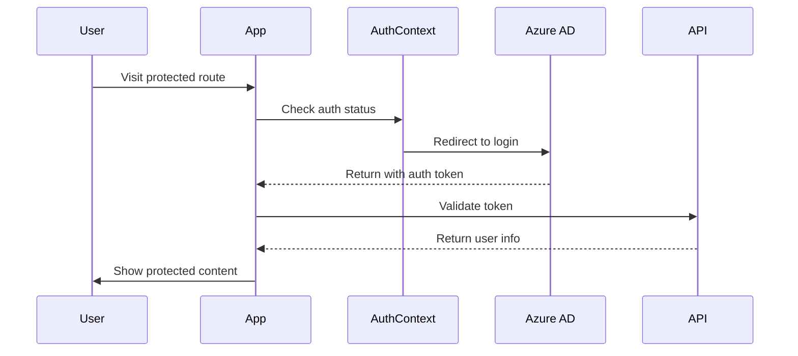

# Escala Fácil - Work Schedule Management System

A modern web application for managing work schedules, built with Next.js, TypeScript, and Azure services. This system allows companies to manage their employees' schedules efficiently and securely.

## Table of Contents
- [Overview](#overview)
- [Features](#features)
- [Tech Stack](#tech-stack)
- [Prerequisites](#prerequisites)
- [Getting Started](#getting-started)
  - [Local Development](#local-development)
  - [Environment Variables](#environment-variables)
- [Project Structure](#project-structure)
- [Authentication](#authentication)
  - [Azure AD Setup](#azure-ad-setup)
  - [Auth Flow](#auth-flow)
  - [User Information](#user-information)
- [Deployment](#deployment)
  - [Azure Static Web Apps](#azure-static-web-apps)
  - [GitHub Actions](#github-actions)
- [API Integration](#api-integration)
- [Development Guidelines](#development-guidelines)
- [Troubleshooting](#troubleshooting)

## Overview

Escala Fácil is a comprehensive work schedule management system that allows:
- Company registration and management
- Employee management
- Schedule creation and management
- Secure authentication using Azure AD
- Role-based access control

## Features

- **Company Management**
  - Create, update, and delete companies
  - View company details and employee lists
  - Manage company-specific settings

- **Employee Management**
  - Add and remove employees
  - Assign employees to companies
  - Manage employee information

- **Authentication & Authorization**
  - Secure login with Azure AD
  - Role-based access control
  - Protected routes and API endpoints

## Tech Stack

- **Frontend Framework**: Next.js 14
- **Language**: TypeScript
- **Styling**: Tailwind CSS
- **UI Components**: Geist UI
- **Authentication**: Azure AD
- **Hosting**: Azure Static Web Apps
- **Version Control**: Git
- **CI/CD**: GitHub Actions

## Prerequisites

Before you begin, ensure you have:
- Node.js (v18 or higher)
- npm or yarn package manager
- Azure account with:
  - Azure Static Web Apps service
  - Azure Active Directory tenant
- GitHub account (for deployment)

## Getting Started

### Local Development

1. Clone the repository:
```bash
git clone https://github.com/yourusername/escala-facil-front.git
cd escala-facil-front
```

2. Install dependencies:
```bash
npm install
# or
yarn install
```

3. Set up environment variables:
   - Copy `.env.development` to `.env.local`
   - Update variables (see [Environment Variables](#environment-variables))

4. Run the development server:
```bash
npm run dev
# or
yarn dev
```

### Environment Variables

Create a `.env.local` file with:

```env
# API Configuration
NEXT_PUBLIC_API_URL=http://localhost:7071/api

# Azure AD Configuration
NEXT_PUBLIC_AZURE_AD_CLIENT_ID=your_client_id
NEXT_PUBLIC_AZURE_AD_TENANT_ID=your_tenant_id
AZURE_AD_CLIENT_SECRET=your_client_secret

# Other Configuration
NODE_ENV=development
```

## Project Structure

```
src/
├── app/           # Next.js app directory (pages and layouts)
├── lib/           # Utility functions and shared logic
├── types/         # TypeScript type definitions
└── types.ts       # Global type definitions
```

## Authentication

### Azure AD Setup

1. Register a new application in Azure AD:
   - Go to Azure Portal > Azure Active Directory
   - App Registrations > New Registration
   - Set redirect URI: `https://your-app-url/.auth/login/aad/callback`

2. Configure Authentication:
   - Enable ID tokens
   - Add permissions:
     - Microsoft Graph > User.Read
     - Any custom API permissions

3. Create client secret:
   - Certificates & Secrets > New client secret
   - Save the generated value

### Auth Flow

1. **Initial Access**:
   - User visits protected route
   - ProtectedRoute component checks auth status
   - If not authenticated, redirects to Azure AD login

2. **Login Process**:


3. **Protected Routes**:
   - All routes under `/empresas/*` and `/funcionarios/*` are protected
   - Requires authenticated user role

### User Information

The authenticated user object contains:
```typescript
interface ClientPrincipal {
  identityProvider: string;  // 'aad'
  userId: string;           // Unique ID
  userDetails: string;      // Email
  userRoles: string[];     // User roles
  claims?: {
    [key: string]: string;
  };
}
```

Access user info in components:
```typescript
import { useAuth } from '@/lib/auth-context';

function Component() {
  const { user, isAuthenticated } = useAuth();
  // Use user information
}
```

## Deployment

### Azure Static Web Apps

1. Create Static Web App in Azure Portal:
   - Choose GitHub as source
   - Select repository and branch
   - Configure build details:
     - Build Preset: Next.js
     - App location: "/"
     - Output location: "out"

2. Add application settings:
   - Go to Configuration
   - Add required environment variables

### GitHub Actions

The workflow (`.github/workflows/azure-static-web-apps.yml`) handles:
- Automated builds on push/PR
- Environment variable injection
- Deployment to Azure
- PR preview environments

## API Integration

The API client (`src/lib/api.ts`) provides:
- Authenticated requests
- Company management endpoints
- Employee management endpoints

Example usage:
```typescript
const api = createApiClient();
const companies = await api.companies.list();
```

## Development Guidelines

1. **Code Style**:
   - Use TypeScript for type safety
   - Follow ESLint rules
   - Use Prettier for formatting

2. **Component Structure**:
   - Functional components with hooks
   - Props interface definitions
   - Error boundaries where needed

3. **State Management**:
   - Use React Context for global state
   - Local state with useState
   - Proper error handling

## Troubleshooting

Common issues and solutions:

1. **Authentication Issues**:
   - Check Azure AD configuration
   - Verify environment variables
   - Check browser console for errors

2. **Build Errors**:
   - Ensure Node.js version compatibility
   - Clear .next directory
   - Check for type errors

3. **Deployment Issues**:
   - Verify GitHub Actions secrets
   - Check Azure Static Web Apps logs
   - Validate staticwebapp.config.json

## Contributing

1. Fork the repository
2. Create feature branch
3. Commit changes
4. Push to branch
5. Create Pull Request

## License

This project is licensed under the MIT License.

## Support

For support, please:
1. Check documentation
2. Search existing issues
3. Create new issue if needed

---

For more information, contact the development team or refer to the internal documentation.